# IMOS Toolbox – Deployment Database (DDB) Schema

> Auto-generated from codebase analysis. The DDB is accessed via ODBC/JDBC
> (Java) or CSV flat-files. There are **no static Java schema classes**; column
> metadata is read dynamically from `ResultSetMetaData`. The canonical schema
> below is therefore **inferred from every `executeQuery` call-site, NetCDF
> template tokens, and Java test fixtures** in the repository.

The machine-readable Python representation now lives in
`src/imos_toolbox/ddb/schema.py`. It exposes the same inferred schema as:

- SQLAlchemy `MetaData` / `Table` objects for Alembic-compatible database management
- JSON-serializable schema documents
- database-agnostic DDL text
- generated JSON Schema documents and validation helpers

---

## Entity-Relationship Diagram (Mermaid)

```mermaid
erDiagram

    FieldTrip {
        string FieldTripID PK "Primary key – e.g. NRSMAI-2015-06-26"
        date   DateStart       "Trip start date"
        date   DateEnd         "Trip end date"
        string FieldDescription "Free-text description"
    }

    DeploymentData {
        string EndFieldTrip       FK "FK → FieldTrip.FieldTripID"
        string Site               FK "FK → Sites.Site"
        string Station               "Station identifier"
        string InstrumentID       FK "FK → Instruments.InstrumentID"
        double InstrumentDepth       "Nominal depth (m)"
        string FileName              "Raw data filename"
        string DeploymentType        "e.g. Mooring, BurstInterval"
        string TimeZone              "UTC offset or timezone code"
        string Comment               "Free-text comment"
        date   TimeSwitchOn          "Instrument powered on"
        date   TimeFirstWet          "Instrument first wet"
        date   TimeFirstInPos        "First in-position time"
        date   TimeFirstGoodData     "Start of good data window"
        date   TimeLastGoodData      "End of good data window"
        date   TimeLastInPos         "Last in-position time"
        date   TimeOnDeck            "Instrument back on deck"
        date   TimeSwitchOff         "Instrument powered off"
        double StartOffset           "Clock offset at start (seconds)"
        double EndOffset             "Clock offset at end (seconds)"
        date   TimeDriftInstrument   "Instrument time at drift check"
        date   TimeDriftGPS          "GPS time at drift check"
        string DepthTxt              "Textual depth label"
        string PersonnelDownload  FK "FK → Personnel.StaffID"
    }

    CTDData {
        string FieldTrip          FK "FK → FieldTrip.FieldTripID"
        string Site               FK "FK → Sites.Site"
        string Station               "Station identifier"
        string InstrumentID       FK "FK → Instruments.InstrumentID"
        double InstrumentDepth       "Nominal depth (m)"
        string FileName              "Raw data filename"
        string TimeZone              "UTC offset or timezone code"
        string Comment               "Free-text comment"
        date   DateFirstInPos        "Date portion – first in position"
        date   TimeFirstInPos        "Time portion – first in position"
        date   DateLastInPos         "Date portion – last in position"
        date   TimeLastInPos         "Time portion – last in position"
        double Latitude              "Latitude (decimal degrees)"
        double Longitude             "Longitude (decimal degrees)"
    }

    Sites {
        string Site             PK "Short site code"
        string SiteName            "Full site name"
        string Description         "Site description"
        double Latitude            "Latitude (decimal degrees)"
        double Longitude           "Longitude (decimal degrees)"
        string ResearchActivity    "Research-activity tag"
    }

    Instruments {
        string InstrumentID     PK "Unique instrument identifier"
        string Make                "Manufacturer"
        string Model               "Instrument model"
        string SerialNumber        "Serial number"
    }

    Sensors {
        string SensorID         PK "Unique sensor identifier"
        string Parameter           "Comma-delimited parameter list"
        string SerialNumber        "Sensor serial number"
    }

    InstrumentSensorConfig {
        string InstrumentID     FK "FK → Instruments.InstrumentID"
        string SensorID         FK "FK → Sensors.SensorID"
        date   StartConfig         "Config validity start"
        date   EndConfig           "Config validity end"
        bool   CurrentConfig       "Is current config flag"
    }

    Personnel {
        string StaffID          PK "Staff identifier"
        string Organisation        "Organisation / institution"
        string FirstName           "First name"
        string LastName            "Last name"
    }

    %% ── Relationships ──────────────────────────────────────
    FieldTrip        ||--o{ DeploymentData        : "has deployments"
    FieldTrip        ||--o{ CTDData               : "has CTD casts"
    Sites            ||--o{ DeploymentData        : "located at"
    Sites            ||--o{ CTDData               : "located at"
    Instruments      ||--o{ DeploymentData        : "deployed as"
    Instruments      ||--o{ CTDData               : "used in"
    Instruments      ||--o{ InstrumentSensorConfig : "configured with"
    Sensors          ||--o{ InstrumentSensorConfig : "belongs to"
    Personnel        ||--o{ DeploymentData        : "downloaded by"
```

---

## Table Details

### FieldTrip
Top-level organisational entity representing a field expedition.

| Column            | Type   | Notes |
|-------------------|--------|-------|
| `FieldTripID`     | string | **PK** – e.g. `NRSMAI-2015-06-26` |
| `DateStart`       | date   | Trip start |
| `DateEnd`         | date   | Trip end |
| `FieldDescription`| string | Free-text |

### DeploymentData
One row per instrument deployment (time-series / mooring workflow).

| Column               | Type   | Notes |
|----------------------|--------|-------|
| `EndFieldTrip`       | string | **FK → FieldTrip.FieldTripID** |
| `Site`               | string | **FK → Sites.Site** |
| `Station`            | string | |
| `InstrumentID`       | string | **FK → Instruments.InstrumentID** |
| `InstrumentDepth`    | double | metres |
| `FileName`           | string | Raw data file |
| `DeploymentType`     | string | e.g. `Mooring` |
| `TimeZone`           | string | UTC offset |
| `Comment`            | string | |
| `TimeSwitchOn`       | date   | |
| `TimeFirstWet`       | date   | |
| `TimeFirstInPos`     | date   | |
| `TimeFirstGoodData`  | date   | |
| `TimeLastGoodData`   | date   | |
| `TimeLastInPos`      | date   | |
| `TimeOnDeck`         | date   | |
| `TimeSwitchOff`      | date   | |
| `StartOffset`        | double | seconds |
| `EndOffset`          | double | seconds |
| `TimeDriftInstrument`| date   | |
| `TimeDriftGPS`       | date   | |
| `DepthTxt`           | string | |
| `PersonnelDownload`  | string | **FK → Personnel.StaffID** |

### CTDData
One row per CTD profile cast (profile workflow).

| Column            | Type   | Notes |
|-------------------|--------|-------|
| `FieldTrip`       | string | **FK → FieldTrip.FieldTripID** |
| `Site`            | string | **FK → Sites.Site** |
| `Station`         | string | |
| `InstrumentID`    | string | **FK → Instruments.InstrumentID** |
| `InstrumentDepth` | double | metres |
| `FileName`        | string | Raw data file |
| `TimeZone`        | string | |
| `Comment`         | string | |
| `DateFirstInPos`  | date   | |
| `TimeFirstInPos`  | date   | |
| `DateLastInPos`   | date   | |
| `TimeLastInPos`   | date   | |
| `Latitude`        | double | decimal degrees |
| `Longitude`       | double | decimal degrees |

### Sites

| Column            | Type   | Notes |
|-------------------|--------|-------|
| `Site`            | string | **PK** |
| `SiteName`        | string | |
| `Description`     | string | |
| `Latitude`        | double | decimal degrees |
| `Longitude`       | double | decimal degrees |
| `ResearchActivity`| string | |

### Instruments

| Column         | Type   | Notes |
|----------------|--------|-------|
| `InstrumentID` | string | **PK** |
| `Make`         | string | Manufacturer  |
| `Model`        | string | |
| `SerialNumber` | string | |

### Sensors

| Column        | Type   | Notes |
|---------------|--------|-------|
| `SensorID`    | string | **PK** |
| `Parameter`   | string | Comma-delimited list of measured parameters |
| `SerialNumber`| string | |

### InstrumentSensorConfig
Junction table linking instruments to sensors with temporal validity.

| Column          | Type    | Notes |
|-----------------|---------|-------|
| `InstrumentID`  | string  | **FK → Instruments.InstrumentID** |
| `SensorID`      | string  | **FK → Sensors.SensorID** |
| `StartConfig`   | date    | |
| `EndConfig`     | date    | |
| `CurrentConfig` | boolean | |

### Personnel

| Column        | Type   | Notes |
|---------------|--------|-------|
| `StaffID`     | string | **PK** |
| `Organisation`| string | |
| `FirstName`   | string | |
| `LastName`    | string | |

---

## Data-Type Mapping (Java → MATLAB)

From `java2struct` in `DDB/executeDDBQuery.m`:

| Java Type                          | MATLAB Type     |
|------------------------------------|-----------------|
| `java.lang.String`                 | `char`          |
| `java.lang.Double`                 | `double`        |
| `java.lang.Integer`               | `double` (coerced) |
| `java.lang.Boolean`               | `double` (0/1)  |
| `java.util.Date` / `java.sql.*`   | `datenum`       |

---

## Access Patterns

| Call-site                     | Table                    | Filter field      | Source of filter value       |
|-------------------------------|--------------------------|--------------------|------------------------------|
| `GUI/startDialog.m`          | `FieldTrip`              | *(all)*            | —                            |
| `Util/getDeployments.m`      | `FieldTrip`              | `FieldTripID`      | User selection               |
| `Util/getDeployments.m`      | `DeploymentData`         | `EndFieldTrip`     | `FieldTrip.FieldTripID`      |
| `Util/getDeployments.m`      | `Sites`                  | `Site`             | `DeploymentData.Site`        |
| `Util/getCTDs.m`             | `FieldTrip`              | `FieldTripID`      | User selection               |
| `Util/getCTDs.m`             | `CTDData`                | `FieldTrip`        | `FieldTrip.FieldTripID`      |
| `Util/getCTDs.m`             | `Sites`                  | `Site`             | `CTDData.Site`               |
| `FlowManager/importManager.m`| `Instruments`            | `InstrumentID`     | `DeploymentData.InstrumentID`|
| `GUI/dataFileStatusDialog.m` | `Sites`                  | `Site`             | `DeploymentData.Site`        |
| `NetCDF/makeNetCDFCompliant.m`| `InstrumentSensorConfig`| `InstrumentID`     | `DeploymentData.InstrumentID`|
| `NetCDF/makeNetCDFCompliant.m`| `Sensors`               | `SensorID`         | `InstrumentSensorConfig.SensorID`|
| `Util/parseAttributeValue.m` | *(dynamic)*              | *(template token)* | `[ddb …]` tokens             |

---

## Notes

1. **No static Java schema classes exist** – despite historical references to
   `org.imos.ddb.schema.*`, the JDBC/ODBC layer uses `ResultSetMetaData` to
   read columns dynamically.  Columns listed above are those referenced in
   MATLAB code and templates; actual databases may contain additional columns.

2. **CSV mode** – when `toolbox.ddb` points to a directory, each table is
   read from `<TableName>.csv` with a header row of column names and a second
   row of format specifiers.

3. **Template tokens** – NetCDF templates use `[ddb FieldName]` and
   `[ddb LocalField RemoteTable RemoteField TargetField]` to perform
   single-hop lookups at export time (see `Util/parseAttributeValue.m`).
